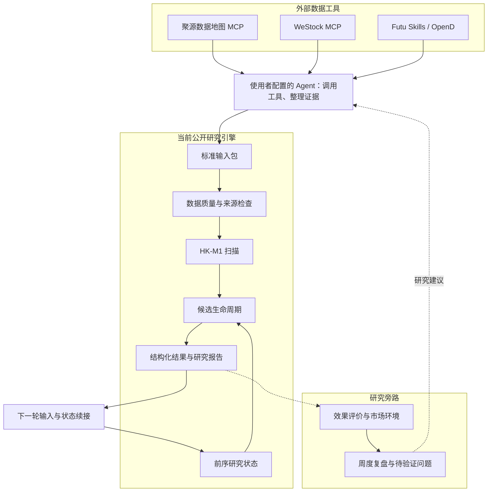

<h1 align="center">HKSC</h1>

<p align="center">AI-assisted Hong Kong equity research</p>

<p align="center">
  <a href="LICENSE"></a>
  <a href="pyproject.toml"></a>
  
</p>

<p align="center">
  <a href="#项目简介">简介</a> ·
  <a href="#主要功能">功能</a> ·
  <a href="#系统架构">架构</a> ·
  <a href="#快速开始">快速开始</a> ·
  <a href="#文档">文档</a> ·
  <a href="#路线图">路线图</a>
</p>

## 项目简介

HKSC 是面向个人投资者的港股研究与决策辅助系统，结合 AI Agent、金融数据工具和确定性计算，在经过流动性与可交易性筛选的港股研究池中发现约 5–60 个交易日的中期机会，提供每日行动计划、策略效果观察和周末复盘。

### 项目背景

HKSC 起源于个人港股研究实践。日常研究不仅需要筛选标的，还需要核对行情与公司信息、记录关注条件、跟踪后续变化，并定期评价研究方法。对个人研究者而言，这些工作往往分散在数据终端、聊天记录、表格和脚本中，难以长期维护。

大模型通过 MCP 和 Skills 可以查询金融数据、阅读资料和辅助分析，但工具调用解决了信息获取，不代表研究流程已经完整。一次分析之后，候选如何继续跟踪、原始判断如何保留、结果如何评价，以及复盘建议如何进入下一轮研究，仍然需要明确的程序和状态管理。

原 HKSC 因此围绕盘后研究逐步组织起数据获取、策略扫描、候选跟踪、前向观察、市场环境记录和周度复盘流程，并使用恒生聚源数据地图 MCP、腾讯自选股 WeStock 与 Futu Skills 支撑不同的数据需求。公开版希望将这套研究流程和工程方法整理为可复用项目，供有类似需求的个人研究者使用和改进。

### 项目目标

HKSC 的目标是在经过流动性与可交易性筛选的港股核心池中，发现 **5–60 个交易日的中期机会**，并帮助个人投资者完成日常跟踪与决策复盘。公开版由使用者提供自己的研究池，不发布原项目的私人池成员。

| 目标 | 具体输出 |
| --- | --- |
| 发现中期机会 | 筛选符合研究方法的少量候选，说明入选依据与风险条件；没有合格机会时保留空结果 |
| 提供每日行动计划 | 明确当天需要关注的候选、继续等待的条件，以及模拟进入或退出的依据，供使用者人工判断 |
| 观察策略效果 | 跟踪信号后续表现，并结合风险、成本和基准评价研究方法，而不只展示个别成功案例 |
| 支持周末复盘 | 汇总本周研究结果与市场环境，整理有效判断、失效条件及下一周需要继续验证的问题 |

数据接入、Agent 协作和状态管理是实现这些目标的基础，不是项目目标本身。上述为完整产品目标，公开版各模块的实现进度见下文。

本仓库是原 HKSC 的脱敏公开版，保留研究方法、公开策略规则与工程设计，不包含私人股票池、真实数据、生产记录或凭证。

> **当前版本**：已提供完整的本地研究演示，包括每日行动计划、候选模拟跟踪、效果观察、只读环境和期间复盘。真实数据通过文件桥接接入；组合模型使用显式假设，不代表真实账户业绩。供应商接入与真实调度未验收。

## 主要功能

| 功能 | 内容 | 当前状态 |
| --- | --- | --- |
| 多源研究输入 | 统一行情与金融事实的来源、日期、复权、单位和证据引用 | 标准文件接口已实现，外部工具调用由使用者配置 |
| 机会发现 | 执行明确的研究规则，记录候选与进入、退出条件 | 已实现 HK-M1 |
| 持续跟踪 | 读取前序结果，推进候选生命周期，保存状态变化 | 已实现候选级模拟 |
| 研究报告 | 输出结构化结果与可读报告，保留输入和历史绑定 | 已实现 JSON、Markdown、HTML |
| 效果评价 | 候选结果、基准参考及显式假设下的组合、成本与回撤观察 | 已实现研究模型，默认不假设零成本 |
| 环境与复盘 | 研究池广度、基准环境、期间复盘与待验证问题延续 | 已实现只读旁路，不自动修改策略 |

### 设计原则

- **研究可延续**：新一轮显式读取前序状态，不依赖模型的聊天记忆。
- **计算与解释分离**：程序负责数值与状态，Agent 负责工具调用、证据整理和解释。
- **依据可追溯**：保存来源、时点、口径、版本及文件绑定，不覆盖已有研究结果。
- **规则变更显式化**：背景分析和复盘建议不直接改写策略，变更需要独立版本与人工确认。
- **本地数据隔离**：第三方数据、凭证和运行结果保存在本地，不随代码发布。

## 系统架构



当前引擎通过文件接口接收工具结果，不包含原生 MCP / OpenD 连接器、后台采集或生产调度。架构中的外部调用需要由使用者配置；复盘问题在后续入口单独展示，不作为策略输入。

### 协作分工

| 角色 | 职责 |
| --- | --- |
| AI / Agent | 查询只读数据、整理资料、引用证据、解释计算结果、提出研究问题 |
| Python 引擎 | 校验输入、执行规则、推进状态、维护历史绑定、生成产物 |
| 使用者 | 确定研究目标、复核结论、批准规则变更和后续研究方向 |

日期、来源或历史数据冲突必须显式处理，不通过补数、静默切换来源或改写历史让运行继续。

## 数据来源

原 HKSC 使用以下三类入口。表中列出的是实际使用分工，不代表公开版已经内置全部接口。

| 来源 / 工具 | 数据覆盖 | 研究用途 |
| --- | --- | --- |
| **恒生聚源数据地图 MCP** | 公告、财务、研报、行业与结构化金融事实；原项目也使用过港股行情及 A/H、ADR 查询 | 公司与行业研究、事件背景和事实核验 |
| **腾讯自选股 WeStock MCP** | 历史日线、前复权价格、成交额、成交量、报价与分时 | 盘后扫描输入、价格与成交分析、抽样核对 |
| **Futu Skills / OpenD** | 证券信息、快照、K 线、开盘价、盘口、点差、每手股数、板块、卖空与经纪商等字段 | 标的与行情字段核验、候选跟踪和辅助研究 |

具体字段取决于接口、市场和权限。数据来源与访问工具分开记录，获取时间不代替数据时间，不同来源的复权与单位需要核对后使用。

接入方式见[数据来源说明](docs/data_sources.md)与[Agent 工作流](docs/agent_workflow.md)。使用者自行配置 MCP / Skills，将结果按[输入合同](docs/input_contract.md)整理为本地文件包。

## 快速开始

### 环境要求

- Python 3.10 或更新版本。
- 离线演示仅依赖 Python 标准库，无需数据服务账号或交易软件。
- 真实数据研究需要自行配置可用的只读数据工具和相应权限。

### 获取代码

```bash
git clone https://github.com/emersonlee56/hksc-open-source.git
cd hksc-open-source
```

### 运行演示

```bash
python -m hksc demo
```

若本机命令为 `python3`，替换上述 `python`；Windows 可使用 `py -m hksc demo`。

演示生成 140 个虚构标的及 11 个连续研究日，完成行动计划、模拟跟踪、候选与组合模型观察、环境和多期间复盘。打开 `outputs/demo/index.html` 查看总入口，并进入各日与各期报告。

示例报告：[每日行动计划](docs/examples/signal_report.md) · [候选跟踪](docs/examples/followup_report.md) · [效果观察](docs/examples/evaluation_report.md) · [期间复盘](docs/examples/weekly_report.md)

**演示价格、成交数据、日历、基准价格和结果均为合成数据，不代表真实市场表现或真实接入验证。**

输出目录不可覆盖。重复运行时指定新目录：

```bash
python -m hksc demo --output outputs/demo-002
```

可选：安装为本地命令。

```bash
python -m pip install -e .
hksc demo --output outputs/demo-003
```

## 使用方法

### 日常研究入口

```bash
python -m hksc daily --input local/day-001 --output outputs/day-001
python -m hksc daily --input local/day-002 --output outputs/day-002 --prior outputs/day-001
```

每次交付包含行动计划、效果观察与环境旁路。核心失败会阻断；旁路失败会记录降级，不重复运行主线。`--policy` 可提供显式评价假设，`--prior-review` 可延续复盘问题。完整命令见[使用指南](docs/usage.md)。

### 标准数据包

按[输入合同](docs/input_contract.md)准备股票池、日历、行情与来源证据，存放在 `local/`。输入需满足历史长度、覆盖率、复权及单位要求。

### 校验与运行

```bash
python -m hksc validate-input --input local/day-001
python -m hksc run --input local/day-001 --output outputs/day-001
```

### 跨日续接

```bash
python -m hksc run --input local/day-002 --output outputs/day-002 --prior outputs/day-001
```

续接会核对前序结果、股票池、日历与已记录的历史行情。历史被重述时，需要单独复核，不能直接按新交易日继续。

### 输出产物

| 文件 | 内容 |
| --- | --- |
| `scan.json` | 扫描结果与过滤依据 |
| `candidates.json` | 候选及研究条件 |
| `lifecycle.json` / `events.json` | 模拟状态和事件记录 |
| `history_bindings.json` | 历史输入绑定 |
| `report.md` / `report.html` | 可读研究报告 |

## 研究方法

当前研究主线为 **HK-M1：中期动量与结构突破**，结合流动性、绝对与相对动量、均线结构、价格突破和成交确认筛选候选，并定义后续模拟进入、止损、目标与退出。

现有公开规则与参数保留，详见[策略说明](docs/strategy.md)。公司、行业与事件资料用于补充研究背景，不自动改变 HK-M1 的准入条件。

公开策略使用独立研究版本，不继承原项目的生产验收和表现结论。当前候选级模拟不等同于组合回测，也不对应真实账户持仓。

## 项目结构

```text
hksc-open-source/
  hksc/                 命令入口、输入包、演示与运行流程
  hksc_engine/          数据检查、HK-M1 扫描与生命周期
  config/               数据工具配置示例
  docs/                 接口合同、策略说明与示例报告
  tests/                公开研究链测试
  scripts/              发布检查
```

## 文档

| 文档 | 内容 |
| --- | --- |
| [产品需求](docs/PRD.md) | 产品目标、功能范围、实施阶段与验收标准 |
| [使用指南](docs/usage.md) | 日常入口、独立模块与期间复盘命令 |
| [评价口径](docs/evaluation.md) | 候选、组合模型、成本与基准参考 |
| [当前交付](docs/release.md) | 已实现范围、兼容性与限制 |
| [数据来源](docs/data_sources.md) | 来源分工、时间与字段口径 |
| [Agent 工作流](docs/agent_workflow.md) | 外部工具调用与证据整理 |
| [输入合同](docs/input_contract.md) | 标准包、字段与校验要求 |
| [策略说明](docs/strategy.md) | HK-M1 规则与生命周期约定 |
| [发布范围](docs/publication.md) | 脱敏处理与公开边界 |

## 路线图

- [x] 标准输入、来源声明与质量检查
- [x] HK-M1 扫描与候选级生命周期
- [x] 跨轮历史绑定与研究报告
- [x] 合成数据演示
- [x] 显式假设下的组合研究模型、成本与基准参考
- [x] 只读基准与研究池环境观察
- [x] 期间复盘与待验证问题延续
- [x] 统一本地日常入口与连续场景演示
- [ ] 实际供应商接入与字段映射验收
- [ ] 更丰富的环境研究与人工反馈处理
- [ ] 部署、定时运行与跨机器恢复验收

后续建设优先补齐研究闭环。原生数据连接器与多策略扩展需要另行定义，不属于当前已交付能力。

## 贡献

欢迎通过 Issue 或 Pull Request 提交数据映射、输入校验、候选跟踪、报告和研究评价方面的改进。

- 说明问题、输入、预期行为及失败边界。
- 涉及研究规则变更时，说明假设、数据时点和验证方法。
- 优先使用合成数据，不提交凭证、账户信息、私人记录或未经授权的数据。

## 关于作者

**Emerson · HKSC 项目发起人**

现任某一级市场投资机构 **AI 技术高级总监**，负责基金交易相关业务的 AI 转型。

曾任腾讯云金融行业首席架构师、汇添富基金高级架构师、某上市券商高级架构师，拥有多年证券与基金行业从业经验。

目前专注于 **AI × 金融**，探索 AI 在金融业务与投研流程中的应用。HKSC 是个人在 AI 辅助投研方向的开源实践。

## 许可证

代码采用 [MIT License](LICENSE)。第三方数据、MCP 服务、Skills 与 SDK 遵循各自条款，代码开源不授予数据再分发权。服务名称用于说明实际分工，不代表合作背书。

公开仓库使用独立历史，不包含私人股票池、真实数据包、生产账本、收益记录、私人研究历史或凭证。示例独立生成，不改写原项目记录充当脱敏样本。

## 使用限制

本项目用于研究和人工决策辅助。不读取账户、资金、真实持仓、订单或交易登录状态，不创建、修改或撤销订单，不自动交易。研究结果不构成收益保证或投资建议。
